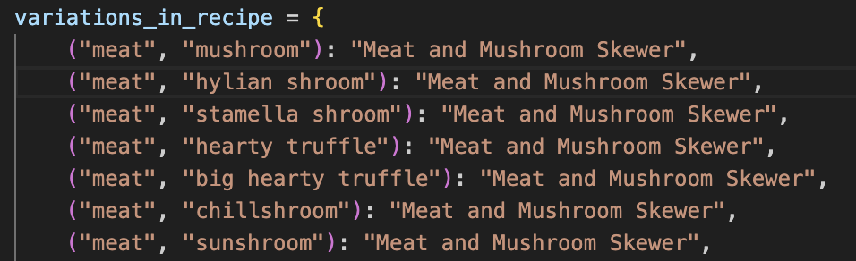

## Provide full attribution to referenced sources (where applicable)
Reference list
Castania, G 2023, The Legend Of Zelda: Tears Of The Kingdom - Complete Recipe Guide, TheGamer, viewed 7 May 2024, <https://www.thegamer.com/the-legend-of-zelda-tears-of-the-kingdom-cooking-recipe-guide-all-recipes/>.

Team, TL of ZT of the K 2023a, Advanced Cooking Guide: Adding Buffs and Bonuses to Dishes | Zelda: Tears of the Kingdom (TotK)｜Game8, Game8｜The Top Gaming and App Walkthroughs Straight from Japan!, viewed 7 May 2024, <https://game8.co/games/Zelda-Tears-of-the-Kingdom/archives/416182#hl_1>.

― 2023b, List of All Recipes and Best Food | Zelda: Tears of the Kingdom (TotK)｜Game8, Game8｜The Top Gaming and App Walkthroughs Straight from Japan!, viewed 7 May 2024, <https://game8.co/games/Zelda-Tears-of-the-Kingdom/archives/411134>.

Zelda Tears of the Kingdom Mushroom Materials & Where To Find n.d., RankedBoost, viewed 7 May 2024, <https://rankedboost.com/zelda-tears-of-the-kingdom/mushroom/>.

## Provide a link to your source control repository
https://github.com/Stephh-E/Zelda-Terminal.git

## Identify any code style guide or styling conventions that the application will adhere to

In making the Zelda Food Combiner I tried to follow the Python Enhancement Proposal (PEP 8) style guide, which provides guidelines and best practices for writing Python code to enhance readability and consistency. 
Here are some key aspects of PEP 8:
Indentation: Code uses four spaces per indentation level. 

Whitespace: Use whitespace to improve readability. For example, use a single space around operators like +, -, =, etc 

Avoid extra whitespace in the following situations:
Inside parentheses, brackets, or braces.
Immediately before a comma, semicolon, or colon.

Naming Conventions:
Use descriptive names for variables, functions, classes, and modules. Ensure variable names are in lowercase with underscores to separate words (snake_case).
Use Capital words (also known as CamelCase) for class names. 

Comments: Write concise and informative comments to  explain complex logic or provide context to the code.

Imports: Import statements should usually be on separate lines and should be sorted alphabetically.

Line Length: Limit all lines to a maximum of 79 characters. For longer lines use backslashes, or use string concatenation.

Avoid Trailing Whitespace: Remove any extra whitespace at the end of lines.
Error Handling: use error handling to fix user error, for example check the number of items entered, and that the input is entered in a valid format

Main Functionality: The main functionality should be inside a if __name__ == "__main__": block, allowing the script to be both run as a standalone program and importas a module without executing the main functionality.

The below screenshot shows correct naming convention, use of quotes and commas to seperate the items in the tuples.

## Develop a list of features that will be included in the application:
Food Combination Function:
- The combine_food(items) function takes a list of food items as input and returns  the resulting dish based on the combination of items.
- The items list is converted into a tuple named combination.
- The function looks up the combination tuple to find the corresponding dish. If the combination is found, the dish is returned. Otherwise, it returns ‘Dubious food’ message

Heart Calculation Function:
- After providing a combination of food items, users can see how many hearts the resulting dish will restore in the game.
- After determining the resulting dish, the application calculates the number of hearts restored based on the ingredients used.
- Each ingredient contributes a certain number of hearts (e.g., meat contributes 2 hearts).
- If a "big hearty truffle" is used, the application returns "Full Recovery" instead of a numerical value.

Modifier Feature:
- Users can see if any buffs or modifiers are applied to the resulting dish based on the ingredients used.
- After determining the resulting dish, the application checks if any of the ingredients used trigger a modifier.
- If a modifier is in the recipe it adds the modifier to the resulting dish's name.
- Multiple modifiers can be applied if multiple triggering ingredients are present in the combination.

# Here is a flowchart written in psuedo code:
1 Start: The program starts execution.
-->
2 Welcome Message: The program displays "Welcome to The Zelda Food Combiner"
-->
3 User Input: The program prompts the user to enter food items separated by commas
-->
4 Input Processing: The user input is processed 
-->
5 Combination Check: The program checks if any combination of the entered food items matches a predefined recipe
-->
6 If a match is found, it proceeds to the next step
-->
7 If no match is found, it displays a message indicating that 'dubious food' has been made
-->
8 Buff Modifier Check: The program checks if any of the entered food items provide Link buffs (powers)
-->
9 Result Display: The program displays the result of the food combination along with any modifiers
-->
10 Hearts Calculation: The program calculates the number of hearts provided by the food combination
-->
11 Repeat or Quit: The program prompts the user to either enter another set of food items or quit
-->
12 If the user chooses to enter another set of food items, the program loops back to step 3
-->
13 If the user chooses to quit, the program ends.

## Develop an implementation Plan

1. Food Combination Dictionary
Priority: High
Deadline: 3 days
Checklist:
- Research Zelda food combinations and compile a list
- Create a Python dictionary to store the food combinations and resulting dishes
- Test the dictionary with sample input combinations to ensure correctness
- Handle unexpected input/errors in user-input
- Add comments to the dictionary as needed- for future reference 

 2. Food Combination Function
Priority: High
Deadline: 2 days
Checklist:
- Define the combine_food function to accept a list of food items as input.
- Create a function to sort the input list, ensuring consistency.
- Return the resulting dish(if the combination exists), otherwise return a message indicating the user has made ‘dubious food’(as an ode to the game, in which when a player cooks an odd combination the result is a barely edible meal called ‘dubious food').
- Test the function with various input combinations(with possible errors) to test if it works

3. User Interaction
Priority: High
Deadline: 3 days
Checklist:
- Set up user interface prompts to welcome users and prompt for input.
- Implement a loop to continuously prompt users for input until they type ‘quit’ to quit
- Handle user input validation to ensure between 2 and 6 items are entered.
- Capitalise input items and pass them to the combine_food function.
- Print the resulting dish or exit message based on the function output.
General Tasks
Priority: Medium
Deadline: Ongoing
Checklist:
- Check code adheres to PEP 8 guidelines
- Add comments and documentation to clarify
- Test the entire application with various input scenarios
- Address any bugs or user experience issues identified during testing
- - Final review and optimisation of code for performance and readability

- For tracking this implementation plan, I used Trello. Here's a screenshot of the Trello board:

## Help Documentation for Zelda Food Combiner Application

Dependencies:
- Python 3
- Standard Python libraries

System/Hardware Requirements:
- Operating System: Windows, macOS, or Linux 
- Processor: Any modern processor capable of running Python 3.x
Memory: 
- At least 2GB RAM recommended
Storage: 
- Sufficient disk space for the app/ and Python if needed
Command Line Arguments:
- The Zelda Food Combiner application accepts command line arguments to specify food items for combination.

## About the Terminal
# Purpose:
This terminal is called The Zelda Food Combiner, and the idea is that someone who plays Zelda(specifically Tears of The Kingdom, released in 2023), can type in different food items, and the terminal tells you what dishes the items make, what effect(buff) it gives Link(eg. Speedy ups Links speed, Enduring ups his endurance) and how many health hearts eating the dish would give Link. 
The target audience for this app is players of the game, the ideal application would be something that players can test the result of in the app, before cooking them in the actual game. It aims to reserve the players' food items so that they can make dishes with the most hearts/buffs as possible without wasting their valuable resources.

# Features:
The app has 3 main features:
1. Combing food items
Combines various food items based on predefined recipes
Determines resulting meal, or returns ‘Dubious Food’ if no matching combination is found
Supports up to 6 food items per combination

2. Modifying Buffs
Ability to modify the resulting dish with certain ingredients that produce certain buffs that enhance the properties of the dish
These are done by mapping certain foods with their power they provide Link, eg. the ‘endura shroom’ appends the resulting string to start with ‘Enduring’ so the user knows that the dish will provide Link with extra endurance in the game

3. Calculates Hearts
Calculates the number if hearts restored by consuming a dish
Different ingredients contribute different amounts of hearts
Full recovery is printed with specific ingredients, so rather than a number value it is implied that Link will recover all his hearts from eating the dish

# Troubleshooting Tips:
If you get ‘Dubious food’ but you think there should be a resulting recipe:
- If the combination is not found and you think there is a corresponding dish, first check for typos or missing ingredients
- Check the input is separated by commas
- Check the ingredients are valid food items listed in the game

If you think the amount of hearts the dish restores is wrong:
- The maths behind the hearts is that all items barring ‘meat’ and ‘big hearty truffle’ are worth 1 heart, ‘meat’ is worth 2 and a ‘big hearty truffle’ is worth a full recovery
- Double check the input items are valid

# Installation 
In your computer terminal, clone the repository from Github:

Step 1:
Enter the below code in your terminal:
git clone https://github.com/Stephh-E/Zelda-Terminal.git

Step 2:

Change directory to be inside the Zelda Terminal by typing in the code:

cd Zelda Terminal 

Step 3:
Enter into the ‘main.py’ folder:

python3 main.py

That's it you’re in!

